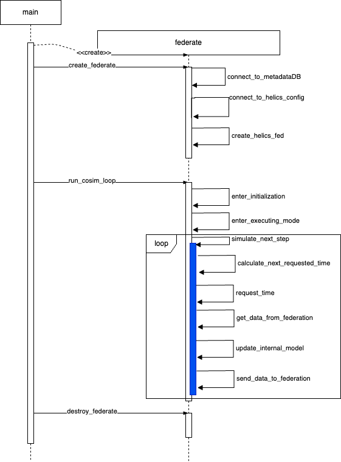

# CoSim Toolbox Federate Class
To aid in making of new Python-based federates and to provide a common integration point for some of the CoSim Toolbox (CST) functionality, a [Federate class](../src/cosim_toolbox/cosim_toolbox/federate.py) has been created. The class has been defined in such a way that, for many simple federates, it will be largely useable as-is, though some degree of customization is always required. Like all programming with classes, to customize the Federate class code, it is expected that the developer will sub-class the CST Federate class and then overload the necessary functions. In some cases you'll want to call the Federate class code first and then add customization, in other cases you'll want to scrap all of a particular method and do your own thing. Its common that some of the customization will involve doing something different with HELICS and thus learning more about HELICS and its APIs.

:::seealso
If you're new to classes and sub-classing has you confused, there are a lot of resources online for getting you up to speed. Here's a [website pretty comprehensively covering it](https://www.pythontutorial.net/python-oop/) and a [YouTube playlist](https://www.youtube.com/watch?v=ZDa-Z5JzLYM&list=PL-osiE80TeTsqhIuOqKhwlXsIBIdSeYtc) doing the same.
:::

As a reference, the class diagram and sequence diagram is shown below that shows the methods of the class and their default use. As shown in the sequence diagram, there are only four methods that need to be called by the code that is creating the CST federate:

- `Federate(federate_name)` - creates the CST federate object
- `create_federate(scenario_name)` - initializes the CST and HELICS federate objects
- `run_cosim_loop()` - Runs the main co-simulation loop
- `destroy_federate()` - Cleans up after the completetion of the co-simulation

## Class Diagram
```{eval-rst}
@startuml
class Federate {
    hfed: h.HelicsFederate
    mddb: DBConfigs
    config: dict
    scenario: dict
    scenario_name: str
    federation: dict
    federation_name: str
    federate: dict
    federate_type: str
    federate_name: str
    scheme_name: str
    start: str
    stop: str
    no_t_start
    period: float
    stop_time: float
    granted_time: float
    next_requested_time: float
    pubs: dict
    inputs: dict
    endpoints: dict
    debug: dict
    use_mdb: bool
    dl: DBResults
    interval: int
    fed_collect: str
    path_csv: str
    output_csv: FileIO
    use_pdb:bool
    connect_to_metdataDB()
}
@enduml
```

**TODO** Update diagram


TODO: probably need to create links to HELICS documentation for some of these.

## Federate class methods

### `create_federate()`
A lot goes into getting a CST federate stood up and this method takes care of it all. First, the method connects to the metadata database using the URI and database name and, among other things, pulls down the HELICS configuration information. The "publications", "subscriptions", "inputs" and "endpoints" attribute dictionaries are then populated with the names, keys, and destinations in the HELICS config file. Lastly, the HELICS federate itself is created. What follows are the details of the methods called in `create_federate()`

#### `connect_to_metadataDB()` or `connect_to_metadataJSON()`
Both of these methods gather the configuration metadata needed to create the federate. In the first case a connection is made to the metadata database to pull this information down. Alternatively, the configuration information can be read from a local configuration file. In either case, the same configuration schema is used and is defined as in the ["Configuration Schema" reference document](./ConfigurationSchema.md). 

The JSON/dictionary that is pulled in is stored in the `federation` attribute.


#### `set_metadata()`
Pulls in start and stop time strings in the configuration information and converts them to [Python datetime](TODO add link) data types. Also defines the analysis name and whether the CST Logger needs to collect its outputs for publication.

#### `connect_to_helics_config()`
This method looks at the "federation" attribute to define a few HELICS-specific attributes of this federate: `name` (federate name), `federate_type` (HELICS federate type, _i.e._ value, message or combo), `period` (size of timestep), and `config` (comprehesive HELICS configuration)

#### `connect_to_dataDB` or `connect_to_dataCSV()`
Depending on whether the time-series database is being used to collect data from the federate (indicated by the `use_pdb` attribute, defined when this federate was instantiated), one of these methods is used to set up the output data collection.

If the time-series database is being used (`use_pdb` set to `True`), a check is made to determine if the existing analysis name is used in the time-series database. If it doesn't, appropriate database structures are instantiated. See the page on the [time-series database under the hood](TimeSeriesDB.md) for further details.

If the output data is being written to a CSV file than that file is created and opened for writing.

#### `create_helics_fed()`
Calls the necessary HELICS API to create the HELICS federate object (stored as the `hfed` attribute) using the `config` attribute defined when `connect_to_helics_config()` was called. To make any HELICS API calls such as might be done when overloading other methods, this HELICS object must exist; overload this method with care to ensure said object is retained.


### `run_cosim_loop()`
This method starts the main co-simulation loop where a time request is made, (when granted a simulation time) data is pulled in from the federation and made available to the core simulation logic (the "internal model" of the federate) which then utilizes this data to execute that logic and then finally publishes new data out to the federation. Each of these steps (and a few not mentioned) have their own methods that can be overloaded as necessary; further details follow

#### `enter_initialization()`
Prior to simulation time zero, HELICS federates have a chance to intialize themselves which can include multiple data exchanges with other federates. This initialization generally requires coordination between federates and thus, in the general case implemented here, no initialization is really made and the HELICS API to enter initialization is simply called. This method is one that could be easily overloaded to change federate behavior.

#### `enter_executing_mode()`
After initialization (if any), a HELICS federate requests time zero by entering executing mode. The implementation in this method simply makes the direct HELICS API call to do so. This method is one that could be easily overloaded to change federate behavior.

#### `simulate_next_time_step()`
Once the federate has been granted time zero, the main co-simulation loop starts where time requests are made and granted, data is pulled in from the federation, the federates internal model is updated, and new values are pushed out to the rest of the federation. This method is the main loop that calls the methods that execute those functions. It is unlikely this method will need to be overloaded as it contains the very general `update_internal_model()` which **must** be overloaded and thus can be made to excute any arbitrary user code. Never say "never", though.

#### `calculate_next_requested_time()`
Determing the time to request in the main co-simulation loop is highly dependent on the function of the federate. Some federates are designed to advance through simulated time in a very regular fashion (_e.g._ fixed time step size) others change their time step size based on the output of their internal model and others rely on changing inputs (as determined by HELICS) to be granted a new time. This method assumes a fixed simulation step size and does the simple math of calculating the next simulation time based on the current simulation time and the value in the `period` attribute for this object. This method is one that could be easily overloaded to change federate behavior to calculate a more customized and better-suited simulation time.

### `request_time()`
Using the output of `calculate_next_requested_time()`, the request for the next simulation time is made in this method. In many analysis, the federation simply moves through simulated time though in other cases, iteration at some or all timesteps is required. This method implements the simple, former case but if the later case with iteration is needed or an asynchronous time request is needed, this method can easily be overloaded and those more complex methods can be implemented.

### `get_data_from_federation()`
This method simply makes the HELICS API calls necessary to get the inputs and messages from the federation this federate has received and stores them in a dictionary ("data_from_federation"). This method saves the user of this class from the bookkeeping and having to learn the (not too complicated) HELICS APIs. There could be a reason to overload this method but one is not springing quickly to mind so probably not?

Data previously stored in the dictionary is erased before being updated to ensure the values are only from the latest granted simulation time.

### `update_internal_model()`
OK, this method **must** be overloaded; if you don't CST throws an error. This is the part of the federate that CST can never even approximate as it requires specific knowledge of the federate logic. Additionally, this method must put any data it wants to be published into the `data_to_federation` dictionary (Federate class attribute) as well as delete out any values from the last simulated time that should not be published. 

This is where the core logic and functionality this federate is providing to the federate is implemented. If this federate is a thermostat, this is where the logic to determine whether to turn the HVAC system off or on is implemented. If this federate exists to solve a fluid dynamics problem, this is where all those fun differential equations are solved.

### `send_data_to_federation()`
Like "get_data_from_federation()", this method takes the data in the dictionary and sends it out to the rest of the federation via HELICS. This is mostly tedious work and it is unlikely this method will need to be overloaded. See the API documentation to see how to format the output value depending on whether the the output in question is a publication or endpoint.

### `destroy_federate()`
After "run_cosim_loop()" has reached the terminal simulation time (as indicated in the object attribute "stop_time"), that loop exits and this method is called. Though not strictly necessary, this method does the clean-up work to exit the co-simulation cleanly and avoid generating any nusiance warning messages.