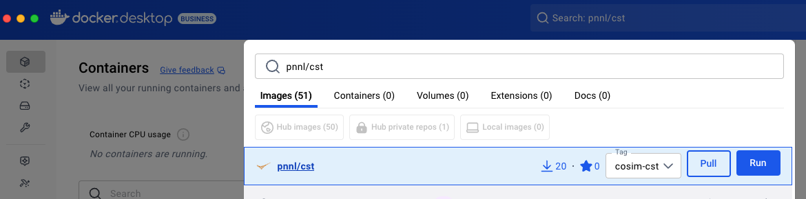

# Installing CoSim Toolbox
The installation of CoSim Toolbox (CST) will vary on how the co-simulation is expected to be run. In fact, there are a number of different installation and configuration styles dependent on what type of functionality CST is intended to supply. You can think of CST as having three components:

1. Persistent services - These are services that will remain running all the time and are usable by any CST-based co-simulation. The most common of these are the databases for mananing metadata and time-series data.
2. APIs - CST provides Python APIs for accessing the persistent services and creating new CST-based HELICS federates. Using these APIs means having them installed in one or more appropriate places, depending on how the analysis is being developed.
3. Docker images - CST provides a docker image with the HELICS co-simulation platform and the CST API installed. This image may or may not be necessary or sufficient for a given analysis but can serve as a starting point for developing the use case. CST also provides Docker images for some simulation tools that have been integrated with CST.

Let's walk through the process of figuring out how to handle these components of CST for a given analysis

:::{important}
For Windows users, CST requires the use of Windows Sub-system for Linux (WSL). [Here are the installation instructions for WSL](https://learn.microsoft.com/en-us/windows/wsl/).
:::

## API Installation
CST provides Python APIs for accessing the persistent services and creating new CST-based HELICS federates. These APIs are installed inside the CST Docker image but are also commonly installed outside the Docker image to allow for development of new tooling that isn't inside the CST Docker image. To install the CST locally and pull the Docker image:

   1.  Clone in the CST repository at `https://github/com/pnnl/cst`
   2.  Install CST by changing your working directory to that of the root of the repository (where "setup.py" resides) and `pip install .`
      - Confirm installation with `pip list` to look for "cosim_toolbox" in the list of installed packages.
   3.  Use the `download_images.sh` shell script to pull the CST Docker image. Alternatively, you can manually pull the image
       - Linux: `docker pull pnnl/cst:cosim-cst`
       - Docker Desktop on macOS and Windows: Search for `pnnl/cst`,select the "cosim-cst" image and then "Pull".
       
      
Development of new CST-based federates can now take place with your local environment and when you're ready, it is possible to migrate your code to the CST Docker image and from that make a new image in which your tool is installed, making it more easily distributable. This is discussed more in the ["Use Case Development" section](./UseCaseDevelopment.md).

## Persistent Service Installation
The persistent services are services that will remain running all the time and are usable by any CST-based co-simulation; the most common of these are the databases for mananing metadata and time-series data. The location of their installation will depend on the needs of a given analysis. For smaller analysis with a single developer and analyst where the data collected is small to modest, installing these services on the same machine where the analysis will be performed is likely to work out fine. If the team is larger where multiple people will need to access the metadata or time-series data or where the datasets may be larger than what your local machine can support, installing these services on a computer that the entire team can reach is likely to work out better. 

The good news is that all of the CST persistent services are stock installations of common servers so installing them should be straight-forward. 

### Local installation
If you decide to run the persistent services on your local machine, CST has scripting in place to launch the services.

1. Install Docker
   - For macOS and Windows, this is accomplished using [Docker Desktop](https://www.docker.com/products/docker-desktop/). Launch Docker Desktop before proceeding.
   - For Linux, the installation will vary based on your distribution; [here are the instructions for Ubuntu](https://docs.docker.com/engine/install/ubuntu/)
2. Start the persistent services
   - Go to the root folder of the CST repository previously cloned
   - Run `source cosim.env` at the command line
   - Go to the "stack" folder in the CST repository
   - run `start_db.sh`
3. Verify that the services are up and running: Postgres, pgadmin, MongoDB, Mongo Express
   - `docker ps` shows the running containers
   - macOS and Windows: Docker Desktop also shows running containers
   - Verify the Postgres (time series) database is running by going to `http://localhost:80` in a web browser. This shows "pgadmin" server page which provides a web interface for the Postgres database server.
   - Verify the Mongo (metadata) database is running by going to `http://localhost:8081` in a web browser. This shows the "Mongo Express" server page which provides a web interface for the Mongo database server.

### Remote installation
Installing the persistent services on a remote server is the same as the above for making a local installation with all the actions taken on the remote computer instead of a local one. After verifying the services are up and running in Step 4 above (executing those commands on the remote computer), connecting to the "pgAmdin" and "Mongo Express" servers from a computer other than the remote one is worthwhile. For example, for your local computer where the persistent servers are not running, use a web browser to connect to pgAdmin and Mongo Express at `http://remote_server_IP:80` and `http://remote_server_IP:8081` where `remote_server_IP` is replaced with the IP of the remote server.