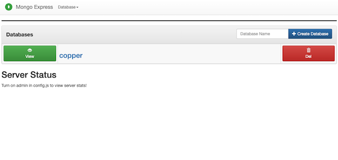
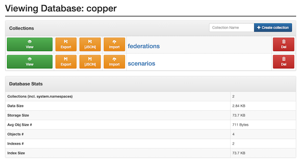
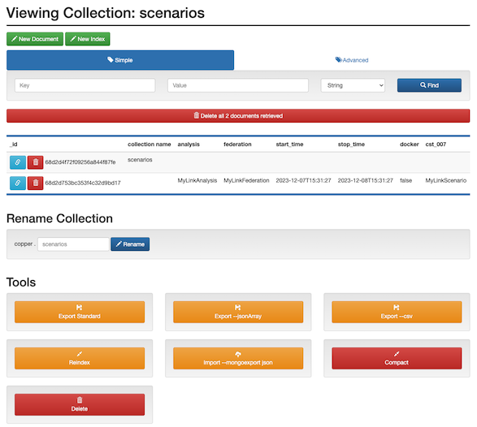
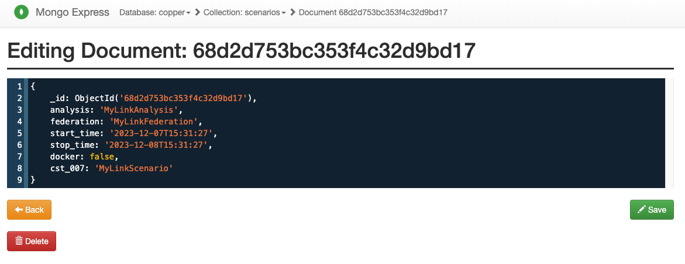

# Metadata (Configuration) Management
It is not unusual for a study to include a sufficient number of scenarios (see the [Terminology page](./Terminology) for how CST uses these terms) that are defined over a sufficiently lengthy period of time that at the conclusion of the experimentation (_i.e._ simulation runs) there is less than absolutely clarity about which parameters applied to which scenarios. Even when the set of scenarios is well-defined in advance, it is not unusual for pre-luminary results to inspire new scenarios with new parameters not included in the original set. All of this is complicated in a co-simulation by the number of federates and the management of their configuration files. 

To help manage this, CoSim Toolbox (CST) provides a metadata data store as a means for storing metadata related to the analysis.  CST provides two data stores: a MongoDB server and a local directory for CSVs; the MongoDB server and an inspector ("Mongo Express") are included as part of CST's "persistent services". CST provides identical APIs ("backends") for accessing both. CST itself uses these APIs to store and retrieve the configuration data for each federate, much of which is HELICS-specific. The APIs are also available for modelers to use to store their own custom data, allowing scenarios to be defined in ways that are helpful.

:::{important}
Though the backends use identical APIs, the nature of the data storage as implemented is quite different. The Mongo data store, if implemented on a server that the analysis team can all reach, becomes a centralized data repository that all team members can access. Conversely, the JSON data store is local-only and designed for local development, testing, or running co-simulations whose data doesn't need to be shared.
:::

## Data Schema
OK, as you might guess, the key advantage of storing JSON-like objects as records (Python dictionaries, "documents" in MongoDB parlance) is that they are not required to have a tabular structure. That is, each record is not required to have the same elements (columns). That said, there are two dictionaries that CST uses that do have a specific structure: the "federations" and "scenarios" dictionaries. It is the responsibility of the analysis team to create these and upload them to the metadata data store prior to trying to run the co-simulation. These dictionaries are held in groups (called "collections" by MongoDB) of the same names.

### "scenarios"
Each dictionary in the "scenarios" defines a few key specific parameters that are needed to run the co-simulation:
- "analysis" (str) - Name of the analysis to which this scenario belongs (see the [Terminology page](./Terminology) for further details)
- "federations" (str) - Name of the federation dictionary use for this analysis
- "start_time" (str) - Start of the simulation time in ISO 8601 format
- "start_time" (str) -Stop of the simulation time in ISO 8601 format
- "docker" (bool) - Indicates whether Docker containers are used to run any of the federates
- "cst_007" (str) - **Not directly defined by user.** Name assigned to the scenario dictionary by the user when added to the metadata data store and added to the dictionary by CST

In addition to these required parameters, modelers can add any number of custom parameters to the dictionary; these will not affect the operation of CST and will be stored in the metadata data store for later use by a modeler. An example scenario dictionary, including a few custom values, would look like the following:

```json
{
    "analysis": "MyAnalysis",
    "federation": "MyFederation",
    "start_time": "2023-12-07T15:31:27",
    "stop_time": "2023-12-08T15:31:27",
    "docker": false,
    "cst_007": "MyScenario",
    "EV penetration": 0.2,
    "location": "California"
}

```

This document must be added to the metadata data store prior to running a co-simulation as CST uses it to correctly instantiate the federates and run the co-simulation.


### "federations" 
The "federation" dictionary holds the definition of the federation being constructed to run the co-simulation. Virtually all of this information is a definition of each federate in the federation, including the commands to run to launch the federate as well as the HELICS configuration information. 

We're not going to go over all the possible HELICS configuration values here (["Configuration Options Reference"](https://docs.helics.org/en/latest/references/configuration_options_reference.html) page documents the options and provides [lots of examples](https://docs.helics.org/en/latest/user-guide/examples/examples_index.html)). Getting this configuration defined correctly is an essential part of running the co-simulation. The dictionary is structured as follows:

```json
{
  "cst_007": "Name federation",
  "federation": {
    "federate1": {
      "logger": false,
      "image": "",
      "command": "python3 -c\"import myfed; myfed.loop(helicsConfig='fed_1.json)\"",
      "HELICS_config": {
        "name": "fed_1",
        "log_level": "warning",
        "publications": [],
        "subscriptions": []
      }
    },
    "federate2": {
    }
  }
}
```

- "cst_007" (str) - **Not directly defined by user.** Name assigned to the scenario dictionary by the user when added to the metadata data store and added to the dictionary by CST
- "federation" (str) - Holds all the configuration information for the federation
- "logger" (str) - Indicates whether any publications created by this federate should be automatically collected and put into the time-series data store
- "image" (str) - The name of the Docker image containing the simulator for this federate. If a Docker image is not being used, this can be left as a null string ("").
- "command" (str) - The command line run to execute the simulation for this federate. If using a Docker image, this is the command that will run when the image is stood up. If using a simulator installed on the host system, this is the command run on the system shell.

Below is an example of a more completely defined "federation" dictionary.

```json
{
    "cst_007": "ExampleFederation",
    "federation": {
        "Battery": {
            "logger":false,
            "image": "cosim-cst:latest",
            "command": "python3 simple_federate.py Battery test_scenario",
            "HELICS_config": {
                "name": "Battery",
                "log_level": "warning",
                "period": 30,
                "broker_address": "10.5.0.2",
                "terminate_on_error": true,
                "tags": {
                    "logger": "yes"
                },
                "publications": {
                    "key": "Battery/current",
                    "type": "double",
                    "unit": "A",
                    "global": true,
                    "tags": {
                        "logger": "yes"
                    }
                },
                "subscriptions": {
                    "key": "EVehicle/voltage",
                    "type": "double",
                    "unit": "V"
                },
                "endpoints": {
                  "more": "things"
                }
            }
        },
        "federate2": {
            "more": "things"
        }
    }
}
```

### Custom Metadata
As previously mentioned, it is possible for users to extend the existing required metadata dictionaries to custom keys and values without causing CST any trouble. Similarly, it is also possible to create custom metadata collections outside the pre-defined "scenarios" and "federations" collections using CST APIs. These custom collections can hold any metadata and will not be used directly by CST. 

## Using CST's Metadata Data Store
:::{note}
There is comprehensive documentation on the metadata backend APIs provided by CST in the [API documentation section](./References.rst), and we're not going to replicate it all here. 
:::

Virtually all the "federation" and "scenario" dictionaries need only to be defined and written in once. For example, if you're conducting a study evaluating the impact on distribution system voltage as EV penetration increases, you may define five scenarios where the EV penetration is 0%, 20%, 40%, 60%, and 80%. Once you've defined the parameters for these scenarios and written them to the metadata data store, they don't need to be re-written every time you run one of the scenarios (unless a parameter value changes). Once these have been defined and added to the metadata data store, they will be usable for all future runs that need them.

The following is an example of how to use the CST APIs to write a scenario dictionaries into the CSV metadata data store.

```python
from cosim_toolbox.dbms import create_metadata_manager
from pprint import pprint

# Create metadata manager
md_mgr = create_metadata_manager(backend="json")
md_mgr.connect()

# Create example metadata dictionaries
example_scenario_20 = {
    "analysis": "example analysis",
    "federation": "example federation",
    "start_time": "2025-01-01T00:00:00",
    "stop_time": "2025-01-14T00:00:00",
    "docker": False,
    "EV penetration": 0.2,
    "location": "Kansas"
}

example_scenario_40 = {
    "analysis": "example analysis",
    "federation": "example federation",
    "start_time": "2025-01-01T00:00:00",
    "stop_time": "2025-01-14T00:00:00",
    "docker": False,
    "EV penetration": 0.4,
    "location": "Kansas"
}

# Add dictionaries to the metadata data store
md_mgr.writer.write_scenario("EV 0.2", example_scenario_20)
md_mgr.writer.write_scenario("EV 0.4", example_scenario_40)

# Read them back out
scenario_names = md_mgr.reader.list_scenarios()
print(f"Scenario names {scenario_names}")

scenario1 = md_mgr.reader.read_scenario(name=scenario_names[0])
print("Data from first listed scenario:")
pprint(scenario1)

md_mgr.disconnect()
```

Running this produces the following results and match the data we put into the database:
```shell
$ python md_example.py
Scenario names ['EV 0.2', 'EV 0.4']
Data from first listed scenario:
{'EV penetration': 0.2,
 'analysis': 'example analysis',
 'docker': False,
 'federation': 'example federation',
 'location': 'Kansas',
 'start_time': '2025-01-01T00:00:00',
 'stop_time': '2025-01-14T00:00:00'}
 ```


##  Exploring Metadata
Generally, the best way of inspecting the time-series data is through the provided CST APIs but there are times (_e.g._ debugging) when looking at the data through alternative means can be helpful; this section explains how to do so.

### JSON Backend (local files)
The JSON backend for the metadata writes any commited metadata to special folders on the local disk where the federate runs. The "metadata_store" folder is created in the same directory as the code that commits the data to the repository. Inside that committed directory (if it doesn't exist), two folders are creates "federations" and "scenarios" (along with any user-defined folders/collections). These hold the CST-required dictionaries (written to disk as JSONs) for running a co-simulation. The folder structure on disk looks as follows:

```shell
├── meta_store
│   ├── custom_metadata
│   │   └── weather.json
│   ├── federations
│   │   └── example_fedeation.json
│   └── scenarios
│       ├── EV 0.2.json
│       └── EV 0.4.json
```

If you want to manually look through the data without using the CST APIs for accessing it, you can navigate through this folder hierarchy and open any of these files with any tool you desire. 

:::{danger}
The preservation of the hierarchy and the structure of these files is necessary for the CST's JSON backend to continue to operate correctly. Modification and/or relocation of these files in any way puts the operation of the backend at jeopardy so tread carefully.
:::


### Mongo Backend (database)

The "mongo" backend for CST writes the time-series data to a Mongo database. Included in the persistent services, alongside the database itself, is a service that provides a web interface to inspect the database: "mongo-express". Here's how to configure mongo-express to allow inspection of the data in the Mongo database.

First, get the IP address of the pgAdmin server by looking for the value of the environment variable "MONGO_HOST"; this is set when setting up the environment by running the `source cosim.env` in the root directory.

```shell
$ printenv | grep MONGO_HOST
```
The value this environment variable is set to is the IP address you can use to connect to pgAdmin on port 80. Just put the following string into a web browser of your choice: `<IP address>:8081`. You should see something like the following:



The default CST metadata database is called "copper" (old name for CST; we should probably change that) and clicking on the green "View" button will show you the collections in that database; "federations" and "scenarios".



Clicking again on either green "View" button will show you the individual dictionaries (Mongo "documents) inside each collection. 



These show up in a list format where clicking the blue link icon on the left opens up a fuller viewer and editor.



:::{danger}
Editing the dictionaries using mongo-express runs the risk of the CST APIs not being able to use it and resulting in a co-simulation that is unable to run. Edit with care.
:::


