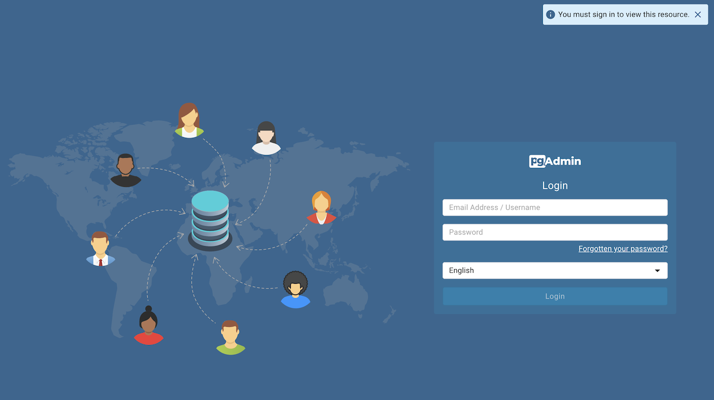
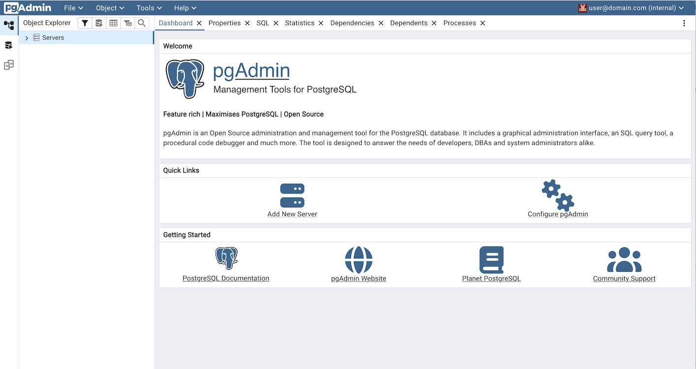
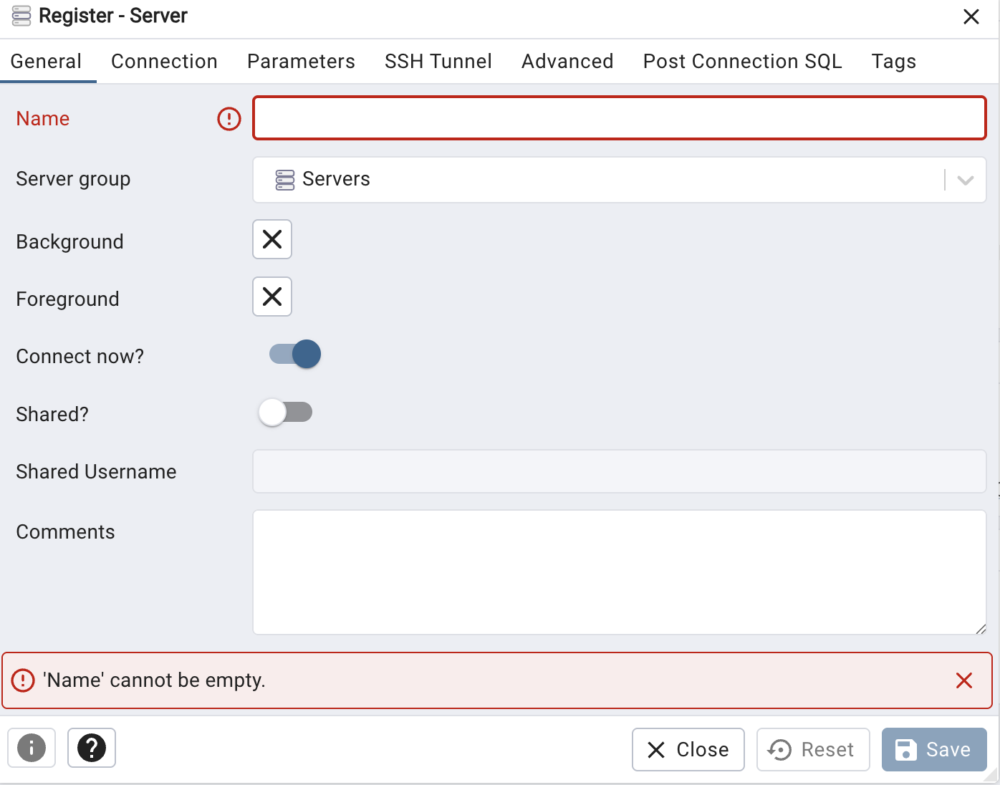
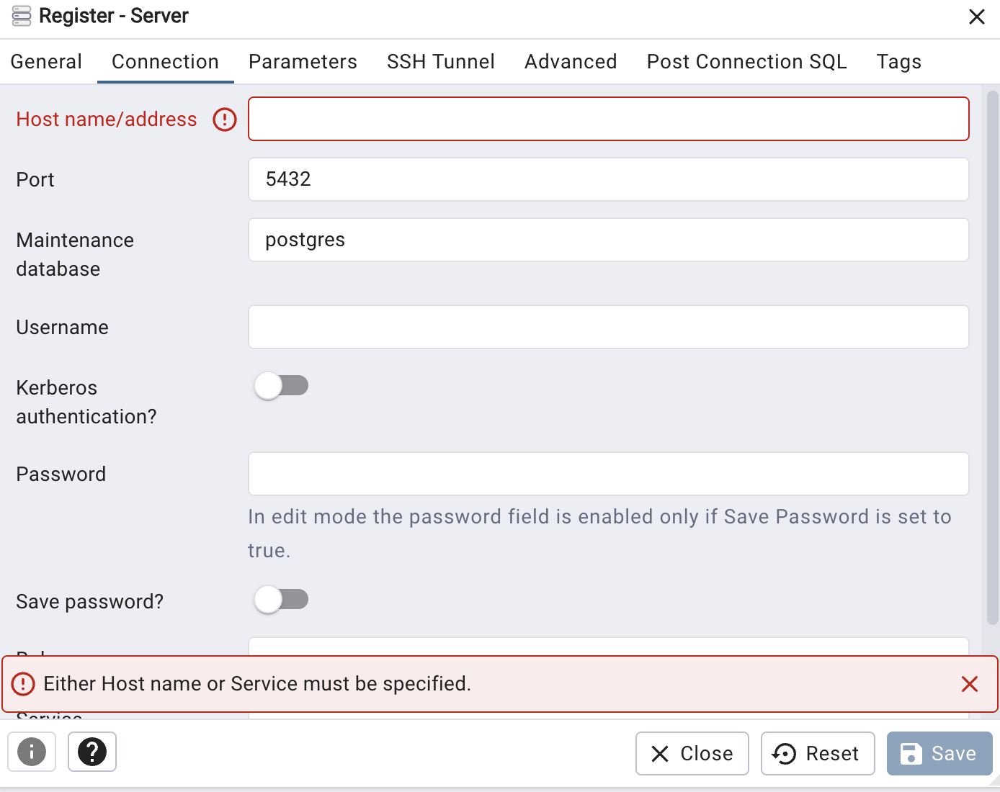
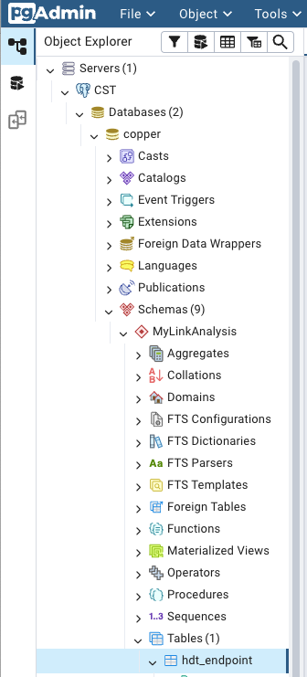

# Time-Series Data Logging
Data management is generally a significant challenge when running a co-simulation. Traditionally, the data being generated is stored in a format native to the simulation tool and typically as a file on disk. This not only produces a growing set of files as the number of federates grows but also can require dedicated tooling to access and correctly parse the data for each simulation tool. The management of this data and its pre- and post-processing is challenge and makes working on teams that need access to the data difficult.

To address these challenges, CoSim Toobox (CST) provides data management with two data stores for time-series data: a Postgres server and a local directory for CSVs; the Postgres server and an inspector ("pgadmin") are included as part of CST's persistent services and are implemented as Docker containers. CST provides identical APIs ("backends") for accessing both. 

:::{important}
Though the backends use identical APIs, the nature of the data storage as implemented is quite different. The Postgres data store, if implemented on a server that the analysis team can all reach, becomes a centralized data responsitory that all team members can access. Conversely, the CSV data store is local-only and designed for local development, testing, or running co-simulations whose data doesn't need to be shared. The CSV data store is generally faster and harder to share.
:::

After specifying which backend and data store to use, data can be automatically collected from federates by two separate means. For federates based on CST's Federate class, the data collection happens automatically, behind the scenes. For federates developed otherwise, a separate logger federate can be included in the federation to do the data collection. In either case, the data that is collected is all of that which is transmitted to the federation via HELICS (configuration is possible to limit the collected data to a subset of this). 

After the data has been collected and is needed for post-processing, the CST APIs take care of extracting the data from the data store and presenting it as a Pandas DataFrame, one of the most common data formats use in the Python community.

This approach to data collection provides several benefits:
- Data collection is easily configured simply by creating a new HELICS output
- Data storage is handled transparently without any user intervention 
- Data format is standardized and independent of the simulation tool that created it
- When using the Postgres backend, data can be accessed by anybody with access to the database, making sharing data much easier

## Data schema
Indpendent of the backend use, time-series data is stored in a tabular format. The columns of the data are as follows:
- "real_time" - imestamp of data collected in an ISO 8061 format
- "sim_time" - ordinal simulation time in seconds where the initial simulated time is "0". (This is the native format that HELICS uses for time management.)
- "scenario" - name of the scenario used for this particular run (see the [Terminology page](./Terminology) for further details)
- "data_name" - name associated with this particular data collected typically formatted as "<Federate name>/<output name>"
- "data_value" - value collected for the specified output at the specified simulation time

To increase effectiveness of the Postgress data store, CST sorts the data by the HELICS data type, storing each data type in its own data table (this is called "third form normal"). If you use a tool to inspect the Postgres database or look at the files as written to disk when using the CSV backend, you'll see that the names of tables/files indicate the data type stored (_e.g._ "hdt_bool", "hdt_complex", "hdt_double"). 

## Using the CST Time-Series APIs
:::{note}
There is comprehensive documentation on the time-series backend APIs provided by CST in the [API documentation section](./References.rst) and we're not going to replicate it all here. 
:::

One use of the time-series APIs is to pre-load the data-store with data one or more federates need during a co-simulation. The task would only need to be done once prior to running the co-simulation and all subsequent runs would be able to access that data in the data store.

A more common use of the time-series APIs is having an analyst performing post-processing on one or more scenarios that have been previously run. In that case, the analyst would only need to read data out of the time-series data store (and potentially the metadata data store to use the various parameter values stored there).

### TSRecords
The atomic unit of time-series data is realized as in the "TSRecord" class; this class exists to ensure the data format needed for the time-series backends is maintained. An instance of the TSRecord class can be thought of as a row or record that ends up in the time-series data store. Generally, when adding data to the data store, individual TSRecords are constructed and added to a Python list. This list is then used by the time-series APIs to add the data in all of those records to the data store.

### Example

The following example shows how to add data to TSRecord instances, add those instances to the data store, and retrieve that same data out of the data store. Again, this is not a comprehensive list of the APIs for handling time-series data; those can be found in the [API documentation section](./References.rst).

```python
from cosim_toolbox.dbms import create_timeseries_manager
from cosim_toolbox.dbms import TSRecord
from datetime import datetime
import time as t

# Creating a list of dummy time-series records 
# To make the data slightly consistent, we use the current real-time as the CST "real_time" timestamp
# and then pause for one second after creating the record. The CST "sim_time" is ordinal time and will
# have the same value as the CST "data_value" since they both increment by one each second.
records = []
for dummy_value in range(5):
    records.append(TSRecord(
        real_time=datetime.now(), 
        sim_time=dummy_value, 
        scenario="example_scenario", 
        federate="dummy_fed", 
        data_name="dummy_value", 
        data_value=dummy_value)
    )
    t.sleep(0.2)

# Setting up the time-series data manager that allows us to write and read data from the CSV data store
with create_timeseries_manager(backend="csv", location="", analysis_name="example_analysis", database="cst") as mgr:
    # Add our made-up data to the data store
    mgr.write_records(records=records)

    # List the scenarios in the data store (should show "test_scenario" as being one)
    print(f"Scenarios: {mgr.list_scenarios()}")

    # List the data types in the data store 
    print(f"Data types: {mgr.list_data_types()}")

    # Read all the data in the data store where the "scenario_name" is our scenario ("test_scenario)
    # Returns this as a Pandas DataFrame
    df = mgr.read_data(scenario_name="example_scenario")
    print(f"Data: {df}")
```

Running this example will produce the following results (with real_time timestamps that correspond to when you run it.):
```shell
$ python ts_examples.py
Scenarios: ['example_scenario']
Data types: ['hdt_integer']
Data:                    real_time  sim_time          scenario   federate    data_name  data_value
0 2025-09-24 06:06:45.705904         0  example_scenario  dummy_fed  dummy_value           0
1 2025-09-24 06:06:45.912023         1  example_scenario  dummy_fed  dummy_value           1
2 2025-09-24 06:06:46.116081         2  example_scenario  dummy_fed  dummy_value           2
3 2025-09-24 06:06:46.317088         3  example_scenario  dummy_fed  dummy_value           3
4 2025-09-24 06:06:46.520976         4  example_scenario  dummy_fed  dummy_value           4
```

## Inspecting Time-Series Data
Generally, the best way of inspecting the time-series data is through the provided CST APIs but there are times (_e.g._ debugging) when looking at the data through alternative means can be helpful; this section explains how to do so.

### CSV Backend (local files)
The CSV backend for time-series writes the data produced by the federates to special folders on the local disk where the federate runs. The "data_store" folder is created in the same directory as the federate itself (if it doesn't already exist) and inside that (if it doesn't exist), a folder of the analysis name is created. Lastly, inside the analysis folder, a folder for each federate running in that directory is created. Inside this folder is one file for each data type being written; these file names correspond exactly to the table names in the Posgres data store (_e.g._ "hdt_bool" has the same data as the file "hdt_bool.csv"). The complete folder heirachy looks like this:

```shell
├── data_store
│   └── <analysis name>
│       ├── <federate 1 name>
│       │   ├── hdt_boolean.csv
│       │   ├── hdt_complex.csv
│       │   ├── hdt_double.csv
│       │   ├── hdt_endpoint.csv
│       │   └── hdt_string.csv
│       └── <federate 2 name>
│           └── hdt_endpoint.csv
```

If you want to manually look through the data without using the CST APIs for accessing it, you can navigate through this folder heirarchy and open any of these files with any tool you desire. 

:::{danger}
The preservation of the heirarchy and the structure of these files is necessary for the CST's CSV backend to continue to operate correctly. Modification and/or relocation of these files in any way puts the operation of the backend at jeopardy so tread carefully.
:::

### Postgres Backed (database)
The "postgres" backend for CST writes the time-series data to a Postgres database. Included in the persistent services, alongside the database itself, is a service that provides a web interface to inspect the database: "pgadmin". Configuring this service takes a little bit of work.

First, get the IP address of the pgadmin server by looking for the value of the environment variable "POSTGRES_HOST"; this is set when setting up the environment by running the `source cosim.env` in the root directory.

```shell
$ printenv | grep POSTGRES_HOST
```

The value this environment variable is set to is the IP address you can use to connect to pgadmin on port 80. Just put the following string into a web browser of your choice: `<IP address>:80`.

You should see a login screen and can use the following credentials to access pgadmin
- username: user@domain.com
- password: SuperSecret



After logging in, you'll need to connect pgadmin to the Postgres database where the data to be inspected resides. Click on the "Add New Server" button in the center pane to do so.



A dialog box will pop up on the "General" tab where the name of the server needs to be defined. Pick a name you like.



Next, go to the "Connection" tab and fill in the following values:
- "Host name/address" - Use the same IP address you used to access pgadmin
- "Username" - worker
- "Password" - worker



Click on the "Save" button and a new database should show up in the left-hand pane under the name you've defined. 

Click on the disclosure triangle for that new database, then "Databases, then "copper", then "Schemas", then the name of the analysis you're interested in. Finally, to look at the tables, open the "Tables" disclosure triangle and right-click on the table (data type) you're interested in viewing and select "View/Edit data" and pick the rows you want to view.



:::{danger}
Editing the time-series data runs the risk of the CST APIs unable to use it. Edit with care.
:::


